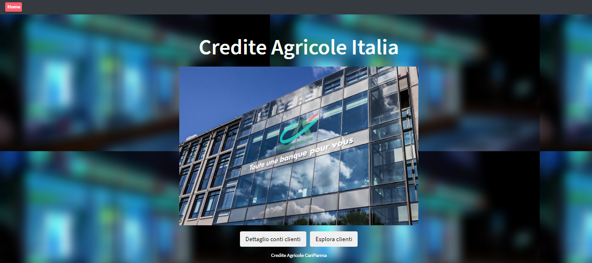

# Credite-Agricole-ontology

Progetto per l'esame di Web Semantico, Università di Bologna, anno 2022

- Realizzazione ontologia con Protège

* RDF, RDFS e OWL
* Aggiunta di regole SWRL
* Interrogazioni con SPARQL

Implementazione di una piccola app per eseguire le query con Apache Jena
*App:

* Back end implementato con Spring Boot
* Apache Jena usata per eseguire le query con SPARQL e recuperare i dati delle ontologie
* Front end implementato con Angular

TODO: Quando hai consegnato e dato l'esame cambiare la visibilità a pubblica
